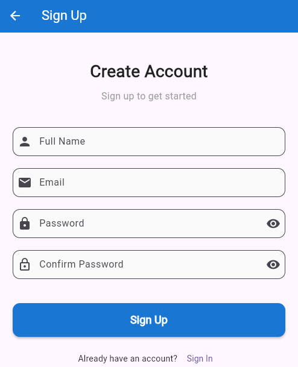
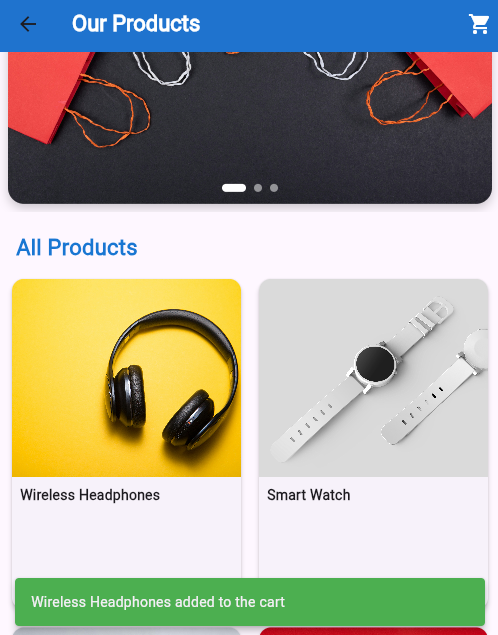

# sprint_flutter_shop

A Flutter shopping app I built during the Microsoft Sprint course. Includes user sign-up/sign-in, product browsing, cart, and Arabic localization.

## Features

* **Welcome Screen**: Gradient UI, custom Suwannaphum font, local & online images, navigation to Sign Up/Sign In.
* **Authentication**:

  * Sign Up: Name, email, password validations, success dialog.
  * Sign In: Email/password validation, smooth fade transition to home.
* **Shopping Home**:

  * AppBar titled “Our Products”
  * Featured products carousel
  * 2-column product grid with Add to Cart (SnackBar feedback)
  * Hot Offers section (ListView)
* **Localization**: English & Arabic support using `.arb` files, Flutter Intl integration, RTL layout.

## Tech

* Flutter SDK 3.0+
* Dart 3.0+
* flutter_localizations & intl

## Setup

1. Clone the repo:

   git clone https://github.com/konoz-mostafa/sprint_flutter_shop.git
   cd sprint_flutter_shop

2. Install dependencies:

   flutter pub get

3. Add `Suwannaphum-Regular.ttf` in `assets/fonts/`
4. Add local images in `assets/images/`
5. Generate localization files:

   flutter gen-l10n
   
6. Run the app:

   flutter run
  

## Screenshots

* Welcome Screen : [Welcome Screen](assets/images/welcome_screen.png)
* Sign Up / Sign In Screens :  , [Sign In](assets/images/signin_screen.png)
* Shopping Home:  ,

## Author

**Konoz Mostafa**

* GitHub: [@konoz-mostafa](https://github.com/konoz-mostafa)
* LinkedIn: [Konoz Mostafa](https://www.linkedin.com/in/konoz-mostafa-b283aa320)

